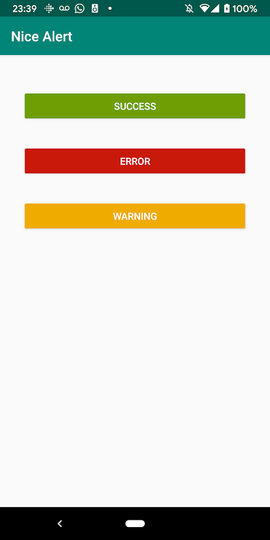
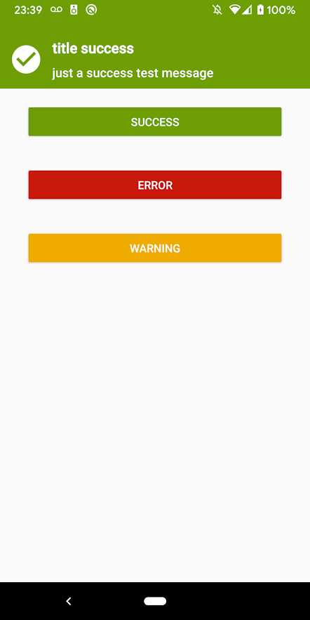
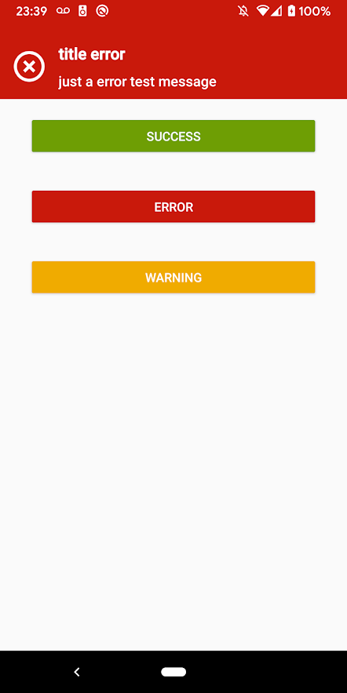
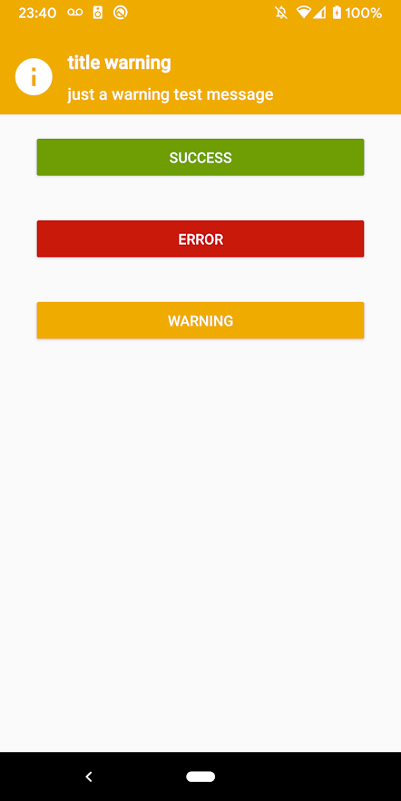

# Jarvis - Android Alert Library



### **Overview - About this project**
A cool and simple alert library made in kotlin

### **Version**
[](https://jitpack.io/#gilsonjuniorpro/Jarvis)

<b>Easy to use:</b> Jarvis library leverages Kotlin's language features for simplicity and minimal boilerplate.<br />
<b>Modern:</b> Works like a Snackbar but on top screen

### 📷 How is this Library
</img>
</img>
</img>
</img>

### 💻Technology
- [Kotlin](https://kotlinlang.org/)

### Download
Jarvis is available on https://jitpack.io/

<b>Step 1</b> - Add it in your root build.gradle at the end of repositories:
```
allprojects {
    repositories {
        ...
        maven { url 'https://jitpack.io' }
    }
}
```
<b>Step 2</b> - Add the dependency
```
dependencies {
    implementation 'com.github.gilsonjuniorpro:Jarvis:version_here'
}
```

### Quick Start
**Jarvis** allows you to show some kinds of alerts like success, error, warning and generic.

To show a <b>success</b> alert you have 2 options:
```kotlin
//send 2 parameters activity and message
Mark.showAlertSuccess(this, message));

//or sending 3 parameters activity, title, message
Mark.showAlertSuccess(this, title, message));
```
---
To show an <b>error</b> alert just replace to showAlertError
```kotlin
//send 2 parameters activity and message
Mark.showAlertError(this, message));

//or sending 3 parameters activity, title, message
Mark.showAlertError(this, title, message));
```
---
To show a <b>warning</b> alert just replace to showAlertWarning
```kotlin
//send 2 parameters activity and message
Mark.showAlertWarning(this, message));

//or sending 3 parameters activity, title, message
Mark.showAlertWarning(this, title, message));
```
---
All these alerts have a background color defined but if you need an alert with other color you can use the <b>generic constructor:</b>
```kotlin
//send 5 parameters activity, title, message, color, time
Mark.showAlert(this, title, message, R.color.title, 5000));
```
- Color: Just remember to send a color in android resouce format <b>R.color.title</b> 
- Time: Milliseconds format <b>5000</b> means 5 seconds
---
All these alerts have an icon defined but if you need an alert with other icon you can use the <b>generic constructor:</b>
```kotlin
//send 6 parameters activity, title, message, color, time, icon
Mark.showAlert(this, title, message, R.color.title, 5000, R.drawable.ic_alert));
```
- Icon: Just remember to send an icon in android resouce format <b>R.drawable.ic_alert</b> 

### Requirements
- AndroidX
- Min SDK 21+
- Compile SDK: 29+
- Java 8+

## Donation
If this project help you reduce time to develop, you can buy me a cup of coffee :) 

<a href="https://www.buymeacoffee.com/gilsonjuniorpro" target="_blank">
    
</a>

### License
```
Copyright 2019 Coil Contributors

Licensed under the Apache License, Version 2.0 (the "License");
you may not use this file except in compliance with the License.
You may obtain a copy of the License at

   https://www.apache.org/licenses/LICENSE-2.0

Unless required by applicable law or agreed to in writing, software
distributed under the License is distributed on an "AS IS" BASIS,
WITHOUT WARRANTIES OR CONDITIONS OF ANY KIND, either express or implied.
See the License for the specific language governing permissions and
limitations under the License.
```
